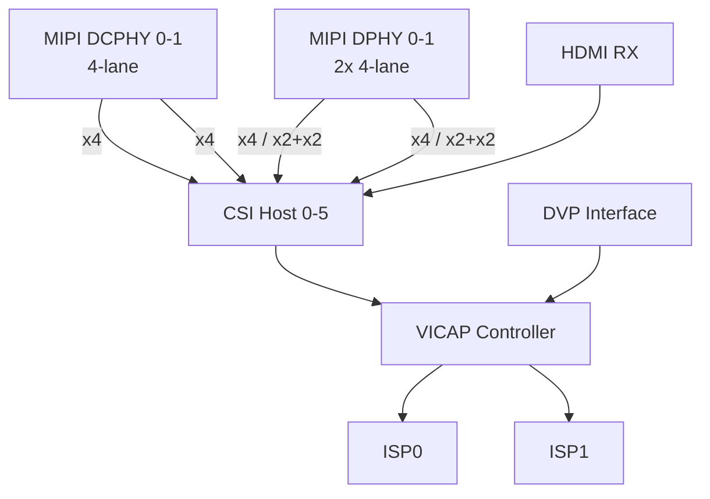

# Camera module concept based on RK3588

Rockchip RK3588 поддерживает подключение до 6 камер c MIPI CSI за счёт встроенного контроллера камер (Image Signal Processor, ISP) и возможности разделения дифференциальных пар (lane) отдельных блоков.

## Общая архитектура обработки изображений:


Четыре физических интерфейса (PHY) предназначены непостредственно для подключения MIPI/CSI камер:

- 2 × MIPI DCPHY (Combo PHY) - универсальные интерфейсы, поддерживающие стандарты D-PHY (до 2.5 Гбит/с на lane, 4-lane) и C-PHY (до 2.5 Гбит/с на lane, 4-lane).

- 2 × MIPI DPHY - интерфейсы только для стандарта D-PHY V1.2. Каждый из них может работать в двух режимах:

  - Полный (Full) режим: Оба DPHY работают как два независимых 4-lane интерфейса.
  - Раздельный (Split) режим: Каждый DPHY логически разделяется на два 2-lane интерфейса для подключения двух камер.

- CSI Host - шесть приёмников, которые подключаются к PHY для приёма данных от всех MIPI-камер.

- VICAP (Video Capture) - контроллер, который собирает видеоданные от всех 6 CSI Host и DVP интерфейса и направляет их на обработку.

- ISP (Image Signal Processor) - два процессора обработки изображений (ISP0 и ISP1), которые занимаются финальной обработкой сигнала от датчиков камер. IPS позволяют реализовать HDR, шумоподавление и автоматическую настройку экспозиции и баланса белого.

## 💡 Максимальное количество и комбинации камер
Итоговое количество камер напрямую зависит от выбранной комбинации интерфейсов:
- 6 камер: 2 × DCPHY (4-lane) + 4 × CSI DPHY (2-lane)
- 5 камер: 2 × DCPHY (4-lane) + 1 × CSI DPHY (4-lane) + 2 × CSI DPHY (2-lane)
- 4 камеры: 2 × DCPHY (4-lane) + 2 × CSI DPHY (4-lane)

## Структура репозитория
```
reimagined-rk3588/
├── README.md
├── docs/
│   ├── hardware/            # Спецификации по железу, инструкции по сборке
│   ├── software/            # Руководства по сборке ядра, прошивке
│   ├── performance/         # Результаты бенчмарков, анализ задержек
│   └── integration/         # Руководства по интеграции с другими системами
│
├── hardware/                # Аппаратная часть
│   ├── schematics/          # Схемы и блок диаграммы модуля
│   ├── pcb/                 # Чертежи плат
│   ├── mechanical/          # 3D-модели, чертежи корпуса (STEP, STL)
│   ├── adapters/            # Проекты переходников и адаптеров
│   └── components/          # Даташиты на ключевые компоненты
│
├── software/                # Программная часть
│   ├── kernel/              # Патчи для ядра Linux, драйверы сенсоров
│   ├── device-tree/         # Device Tree Overlays для RK3588
│   ├── tuning/              # ISP-профили для конкретных камер (JSON/xml)
│   ├── examples/            # Примеры кода (C/C++/Python)
│   └── ai/                  # Примеры моделей и скриптов для NPU (RKNN)
│
├── tools/                   # Вспомогательные утилиты и скрипты
│   └── ...
│
└── images/                  # Скетчи, рисунки, фото и т.д.
```
