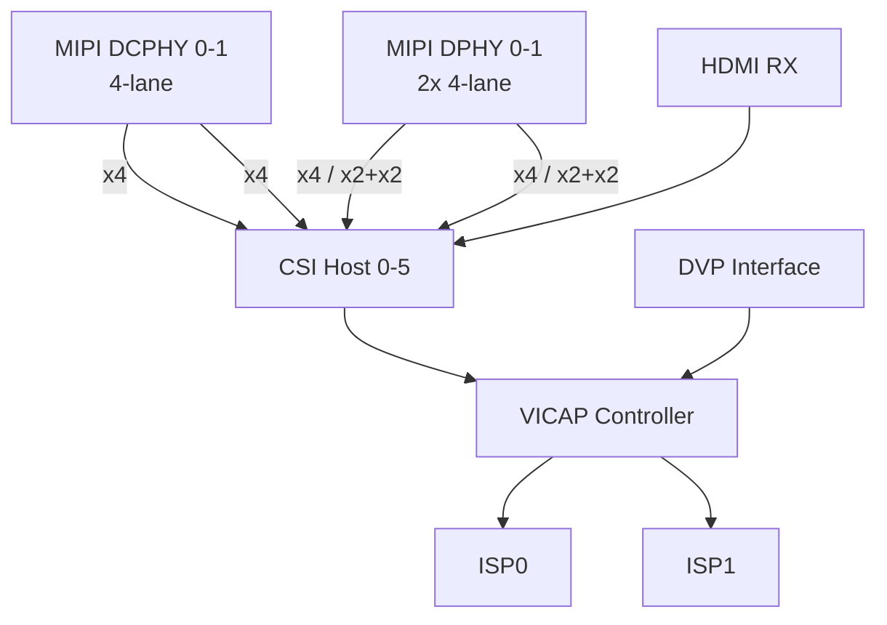

# Модуль камер для RK3588

Rockchip RK3588 поддерживает [подключение до 6 камер](docs/performance/camera_config_example.md) c MIPI CSI за счёт встроенного контроллера камер (Image Signal Processor, ISP) и возможности разделения дифференциальных пар (lane) отдельных блоков.

## Общая архитектура обработки изображений:


Четыре физических интерфейса (PHY) предназначены непостредственно для подключения MIPI CSI камер:

- 2 × MIPI DCPHY (Combo PHY) - универсальные интерфейсы, поддерживающие стандарты D-PHY V2.0 (до 4.5 Гбит/с на lane, 4-lane) и C-PHY V1.1 (до 2.5 Гбит/с на lane, 4-lane).

- 2 × MIPI DPHY (CSI RX PHY) - интерфейсы только для стандарта D-PHY V1.2 (до 2.5Гб/с на lane, 4-lane). Каждый из них может работать в двух режимах:
  - Полный (Full x4) режим: Оба DPHY работают как два независимых 4-lane интерфейса
  - Раздельный (Split x2 + x2) режим: Каждый DPHY логически разделяется на два 2-lane интерфейса для подключения двух камер

- CSI Host - шесть приёмников, которые подключаются к PHY для приёма данных от всех MIPI-камер.

- [VICAP (Video Capture)](docs/hardware/vicap.md) - контроллер, который собирает видеоданные от всех 6 CSI Host и DVP интерфейса и направляет их на обработку.

- [ISP (Image Signal Processor)](docs/hardware/isp.md) - два процессора обработки изображений (ISP0 и ISP1), которые занимаются финальной обработкой сигнала от датчиков камер. IPS позволяют реализовать HDR, шумоподавление и автоматическую настройку экспозиции и баланса белого.

## 💡 Максимальное количество и комбинации камер
Итоговое количество камер напрямую зависит от выбранной комбинации интерфейсов:
- 6 камер: 2 × DCPHY (4-lane) + 4 × CSI DPHY (2-lane)
- 5 камер: 2 × DCPHY (4-lane) + 1 × CSI DPHY (4-lane) + 2 × CSI DPHY (2-lane)
- 4 камеры: 2 × DCPHY (4-lane) + 2 × CSI DPHY (4-lane)

## Структура репозитория
```
reimagined-rk3588/
├── README.md
├── docs/
│   ├── hardware/            # Спецификации по железу, инструкции по сборке
│   ├── software/            # Руководства по сборке ядра, прошивке
│   ├── performance/         # Результаты бенчмарков, анализ задержек
│   └── integration/         # Руководства по интеграции с другими системами
│
├── hardware/                # Аппаратная часть
│   ├── schematics/          # Схемы и блок диаграммы модуля
│   ├── pcb/                 # Чертежи плат
│   ├── mechanical/          # 3D-модели, чертежи корпуса (STEP, STL)
│   ├── adapters/            # Проекты переходников и адаптеров
│   └── components/          # Даташиты на ключевые компоненты
│
├── software/                # Программная часть
│   ├── kernel/              # Патчи для ядра Linux, драйверы сенсоров
│   ├── device-tree/         # Device Tree Overlays для RK3588
│   ├── tuning/              # ISP-профили для конкретных камер (JSON/xml)
│   ├── examples/            # Примеры кода (C/C++/Python)
│   └── ai/                  # Примеры моделей и скриптов для NPU (RKNN)
│
├── tools/                   # Вспомогательные утилиты и скрипты
│   └── ...
│
└── images/                  # Скетчи, рисунки, фото и т.д.
```
## Альтернативные интерфейсы и расширение
В этом разделе приведены варианты подключения камер, несовместимых с MIPI CSI.

**Встроенные интерфейсы:**

- USB 3.0: RK3588 поддерживает USB 3.0 (до 5 Гбит/с), что подходит для подключения UVC-совместимых камер. Необходимо учитывать, что эффективная пропускная способность может быть ограничена (загрузка CPU до 30-40% для 4K@30fps).

- PCIe 3.0: Позволяет подключать специализированные платы захвата. Прямое соединение RK3588 с модулем FPGA через PCIe 3.0 x4, может обеспечить пропускную способность до 4 ГБ/с.

- Интеграция с преобразователями интерфейсов (мостами):
    - LVDS: Для подключения LVDS-камер можно использовать мост [Lontium LT2911R](hardware/components/mipi_converter/Gid1541Pdf_LT2911R_Brief_R1.0.pdf), который преобразует LVDS в MIPI CSI-2.
    - FPGA (преимущественно Gowin): FPGA выступает универсальным решением для приема любых нестандартных интерфейсов (включая высокоскоростные CameraLink). FPGA выполняет роль моста - декодирует входной сигнал и упаковывает его в пакеты MIPI CSI или передает по PCIe. В качестве примера - [отладочный комплект на основе GW2A](https://gowinsemi.com/en/support/devkits_detail/21/) 

- Сетевые интерфейсы:
    - Два встроенных Gigabit Ethernet (GbE): Интеграция с IP-камерами по протоколу RTSP.
    - Для более современных вариантов, следует рассматривать подключение мультигигабитных PHY от 2.5 Гбит/с до 10 Гбит/с к шине PCIe процессора.
 
- HDMI RX:
    - Захват видеоданных с интерфейсом HDMI V2.0, например, камер или видеовыхода компьютера, с помощью интегрированного интерфейса в процессор.
    - Установка [RK628D](hardware/components/mipi_converter/RK628D_datasheet_V1.3.pdf) - преобразователя HDMI / MIPI CSI

## AI-функции и производительность
В этом разделе приведены данные для оценки возможностей встроенной системы NPU для проектирования AI-приложений.

**Характеристики встроенного NPU:**
| Параметр | Значение | Примечание |
|----------|----------|-------------|
| Производительность | до 6 TOPS | Производительность нейросетевого ускорителя |
| Конфигурация ядер | 3 NPU ядра | Поддержка совместной работы всех трёх ядер, двух ядер или независимой работы |
| Поддерживаемые типы данных | int4, int8, int16, float16, bfloat16, tf32 | Целочисленные и плавающие форматы |
| Внутренний буфер | 384 КБ × 3 | Встроенный буфер на каждое ядро |
| Режимы работы | Многозадачный, параллельный | Поддержка множества задач и сценариев одновременно |
| Поддерживаемые фреймворки глубокого обучения | TensorFlow, Caffe, Tflite, Pytorch, Onnx NN, Android NN и др. | Совместимость с популярными фреймворками |
| Питание | Отдельный изолированный домен напряжения | Поддержка DVFS (динамическое регулирование частоты и напряжения) |

**Предварительные бенчмарки NPU (6 TOPS):**

| Модель | Формат | Среднее время инференса (1 кадр) | FPS (оценка) | Примечание |
|--------|--------|--------------------------------|--------------|-------------|
| YOLOv5s | INT8 | ~6.3 мс | ~158 | Оптимизирована с использованием Winograd и разреженности |
| YOLOv11s | FP32 | ~35.7 мс | ~28 | Базовый уровень для FP32 модели |
| YOLOv11s | INT8 | ~16.1 мс | ~62 | Квантование ускоряет инференс в ~2.2 раза с потерей mAP ~2.3% |
| YOLOv11s | FP16 | ~22.2 мс | ~45 | Баланс между скоростью и точностью (потеря mAP ~0.8%) |
| YOLO-NAS_S | INT8 | ~25-30 мс | ~33-40 | Измерено при использовании всех 3 ядер NPU |

**Фреймворк разработки:**
- Классический (CPU/GPU): OpenCV + GStreamer. Позволяет строить гибкие конвейеры обработки.
- AI-фреймворк Rockchip: Основной инструмент — RKNN Toolkit 2 для конвертации моделей из PyTorch/TensorFlow в формат .rknn, а также librknnrt для инференса на NPU.

## Оценка тепловыделения и система охлаждения
Энергопотребление модуля на основе RK3588 в среднем составляет от 6Вт до 15 Вт. Максимальная температура для промышленных устройств может достигать 70°C..85°C.

- Тип системы охлаждения - это некий компромисс между габаритами и защитой от внешнего влияния среды:
    - Пассивное охлаждение: массивный радиатор (с площадью поверхности 30-40 кв.см) для герметичных корпусов без пыли и влаги.
    - Активное охлаждение: вентилятор (например, 40x40x10 мм, 7000 об/мин) для принудительного обдува радиатора.

- Теплоотводящий интерфейс:
    - Термопаста или термопрокладка (с теплопроводностью 3-5 Вт/м·К) для эффективной передачи тепла от чипа к радиатору.
    - Теплотрубки диаметром 6мм..8мм эффективны для сложных конструкций. При 6Вт на 6мм трубку, двух трубок должно хватить на систему с одним процессором. 
